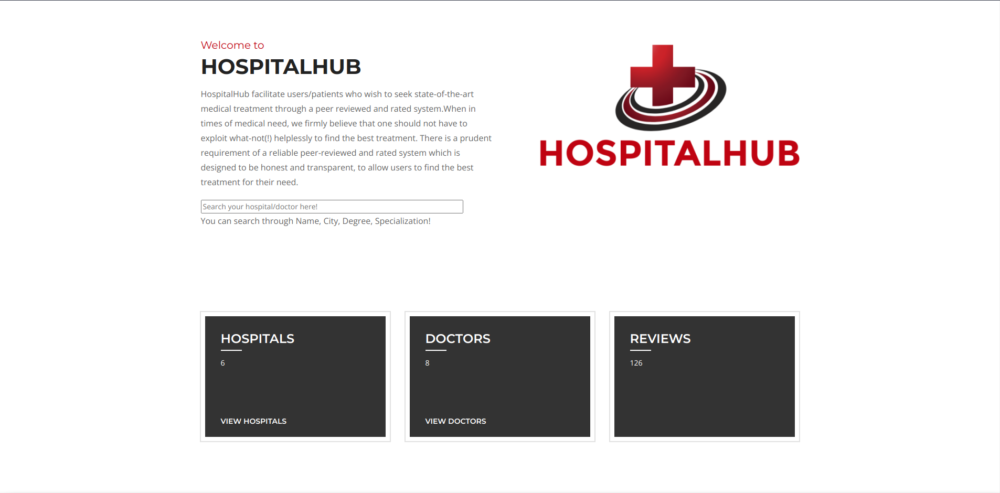
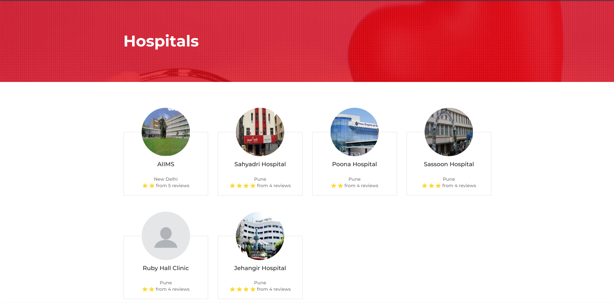

# HospitalHub

A peer review and rating system for healthcare services. HospitalHub enables individuals to search its database of doctors, hospitals, and other healthcare services. It enables doctors and hospitals to enlist themselves. 

The database used here is SQLlite. You should implement a similar design in MySQL and change the database in `HospitalHub/HospitalHub/settings.py`. You may simply uncomment to change to MySQL. 

## To run the server:
- Install the dependencies.
- `cd HospitalHub`
- `python3 manage.py runserver 0.0.0.0:3000` to run on port 3000

It was hosted on Heroku for a brief period. We created this website to learn Django, and later submitted it as our third-year project.